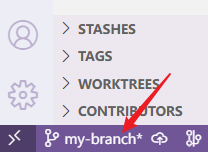
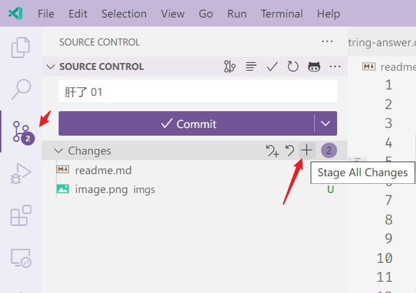
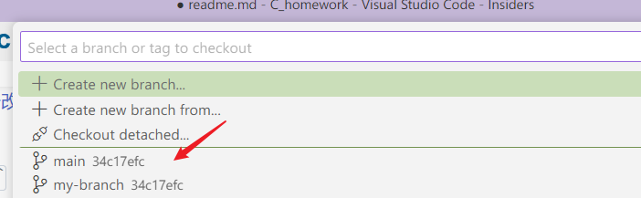
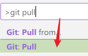
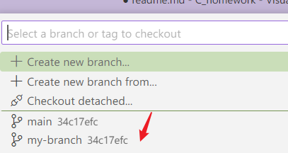
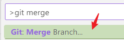
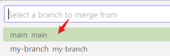

# 更新 git 仓库代码 并 提交自己的代码

1. 用 VSCode 打开 `C_homework` 文件夹
2. 确保在自己的分支（非main）上，如 `my-branch`
   
   

3. 先在自己的分支上保存当前修改
   
   
   

4. 左下角分支切换选择 `main`
   
   
   

5. VSCode 按下 `ctrl + shift + p`，输入 `git pull`，回车
   
    

6. 切换回自己的分支，如 `my-branch`
   
   
   

7. VSCode 按下 `ctrl + shift + p`，输入 `git merge`，回车

    

8. 选择 `main` 分支，回车，这样就把 `main` 分支的代码合并到了自己的分支上

    

9. 撰写自己的代码，按照 第1-2步，保存当前修改，然后推送到远程仓库，按下 `ctrl + shift + p`，输入 `git push`，回车

    